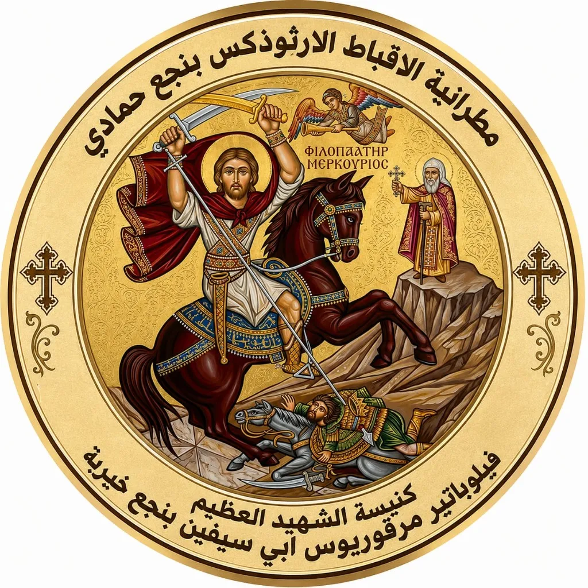

<div align="center">


# ✝️ في ذكرى نياحة القمص بطرس القمص زكريا

<p>
  
  
  
  
</p>

**موقع تذكاري بصفحة واحدة، بلا Backend وبلا خطوة Build — لحفظ ذكرى القمص بطرس القمص زكريا**

### 🔗 [شاهد الموقع مباشرة](https://abouna-botros.minamaherwanis.workers.dev/)

</div>

---

## 🕊️ نبذة عن المشروع

موقع تذكاري إلكتروني من صفحة واحدة (Single Page)، أُنشئ لحفظ ذكرى القمص بطرس القمص زكريا وتوثيق مسيرة خدمته الكهنوتية. بُني الموقع بالكامل باستخدام HTML وCSS وJavaScript خام (Vanilla) دون أي إطار عمل (Framework) أو مكتبات خارجية أو حتى خطوة Build، ما يجعله خفيفًا وسريع التحميل وسهل الصيانة.

يضم الموقع سيرة حياة القمص بطرس ورسامته، أبرز محطات خدمته، أرشيفًا مصورًا من مختلف سنوات الخدمة، تغطية كاملة لمراسم النياحة والجنازة، مقتطفات من مناسبات كنسية متنوعة على مدار العام، ومكتبة صوتية لعظاته وترانيمه.

---

## ✨ المميزات

- 🎬 **Hero متحرك** — تأثير Parallax خفيف يتبع حركة الماوس، وصف شموع متحركة أسفل عنوان الصفحة
- 🖼️ **Carousel موحّد للصور والفيديو** — يعرض الصور ومقاطع يوتيوب المضمّنة داخل نفس الشريط بنمط Coverflow، مع تشغيل تلقائي يتوقف خارج نطاق الرؤية (عبر IntersectionObserver)، ودعم كامل للسحب باللمس
- 🔍 **Lightbox** — عرض الصور بالحجم الكامل، تنقّل بالأسهم ولوحة المفاتيح (متوافق مع اتجاه RTL) وبالسحب باللمس، مع عدّاد للصور
- 🎧 **مشغّل صوت مخصّص** — قائمة تشغيل كاملة، شريط تقدّم، عرض للوقت، وزر تحميل للتسجيلات
- 📱 **قائمة تنقّل للموبايل** (Hamburger Menu) — مع خلفية Backdrop، وإدارة كاملة لخصائص ARIA، وإغلاق بمفتاح Escape
- ♿ **إمكانية وصول مدروسة** — خصائص ARIA على كل عنصر تفاعلي، واحترام كامل لخاصية `prefers-reduced-motion`
- 📐 **تصميم متجاوب بالكامل** — أكثر من 15 نقطة توقف (Breakpoints) تغطي كل المقاسات من الشاشات الكبيرة لأصغر الموبايلات
- 🕯️ **تفاصيل بصرية إضافية** — خلفية Ambient متحركة، شاشة تحميل (Preloader) بشعار الكنيسة، وتأثيرات ظهور تدريجي عند التمرير (Reveal on Scroll)

---

## 🗺️ أقسام الصفحة

| # | القسم | الوصف |
|---|-------|-------|
| 1 | **Header** | شريط تنقّل ثابت مع قائمة موبايل |
| 2 | **Hero** | اسم القمص الراحل مع تأثيري الشموع والـ Parallax |
| 3 | **سيرة** | قصة حياة القمص بطرس ورسامته |
| 4 | **إنجازات** | أبرز 8 محطات في خدمته الكهنوتية |
| 5 | **الصور الأرشيفية** | معرض صور من مختلف سنوات الخدمة |
| 6 | **الجنازة** | تغطية مصوّرة ومرئية لمراسم النياحة والجنازة وصلاة الثالث |
| 7 | **مناسبات** | مقتطفات من مناسبات كنسية (شعانين، جمعة عظيمة، قيامة، ميلاد، غطاس...) ومقاطع ترانيم |
| 8 | **أصوات** | مكتبة صوتية لعظاته وترانيمه |
| 9 | **الإرث** | كلمة ختامية |

> 📊 يضم الأرشيف حاليًا أكثر من **420 صورة وفيديو**، و**8 مقاطع يوتيوب مضمّنة**، و**6 تسجيلات صوتية**، في ملف واحد يتجاوز **5000 سطر** من الكود.

---

## 🛠️ التقنيات المستخدمة

- **HTML5** دلالي (Semantic) بالكامل مع خصائص ARIA لإمكانية الوصول
- **CSS3** خام — CSS Custom Properties لنظام الألوان والمقاسات، Flexbox وGrid، وأكثر من 15 Media Query للتصميم المتجاوب
- **JavaScript (Vanilla ES6+)** — بدون أي مكتبات خارجية: `IntersectionObserver`، `matchMedia`، وTouch Events
- **الخطوط**: Cormorant Garamond وAmiri للعناوين، IBM Plex Sans Arabic للنصوص (عبر Google Fonts)
- **بدون Backend وبدون خطوة Build** — ملف واحد جاهز للعمل فور فتحه

---

## 📁 هيكل المشروع

```
├── index.html              # الصفحة بالكامل (HTML + CSS + JS في ملف واحد)
└── assets/
    ├── images/              # صور الأرشيف والمناسبات (WebP)
    │   └── church-logo-new.webp
    └── audio/                # التسجيلات الصوتية (MP3)
```

> 💡 الصور والتسجيلات الصوتية غير مضمّنة داخل `index.html`، ويجب أن تكون موجودة داخل مجلد `assets/` بنفس المسارات المشار إليها في الكود.

---

## 🚀 التشغيل محليًا

الملف مستقل تمامًا ولا يحتاج أي تثبيت أو `npm install`. الخطوة المهمة الوحيدة هي تشغيله عبر سيرفر محلي بدلًا من فتح الملف مباشرة (`file://`) — لأن المتصفحات تمنع تحميل مقاطع يوتيوب المضمّنة عند فتح الملف مباشرة لأسباب أمنية.

```bash
# باستخدام Python
python -m http.server 8000

# أو باستخدام Node.js
npx serve .
```

ثم افتح المتصفح على `http://localhost:8000`

---

## ☁️ النشر

بما أن الموقع HTML/CSS/JS بحت بدون أي Backend، يمكن استضافته على أي منصة Static Hosting. الموقع منشور حاليًا على:

**Cloudflare Workers** → [abouna-botros.minamaherwanis.workers.dev](https://abouna-botros.minamaherwanis.workers.dev/)

ويدعم النشر بنفس السهولة على:
- GitHub Pages
- Cloudflare Pages
- Netlify / Vercel

---

## ➕ إضافة محتوى جديد

كل قسم أرشيفي (الصور الأرشيفية، الجنازة، مناسبات) منظّم داخل عناصر `<div class="group" data-title="...">`. لإضافة عنصر جديد داخل أي مجموعة:

**إضافة صورة:**
```html
<div class="media-item" data-type="image" data-src="assets/images/اسم-الصورة.webp"></div>
```

**إضافة فيديو يوتيوب (رابط Embed):**
```html
<div class="media-item" data-type="video" data-src="https://www.youtube.com/embed/VIDEO_ID" data-caption="وصف اختياري"></div>
```

ترتيب ظهور العناصر في الصفحة هو نفس ترتيبها في الكود، ويمكن حذف أو تكرار أي سطر بحرية.

لإضافة تسجيل صوتي جديد، أضف عنصر `<li class="audio-playlist__item">` داخل `#audio-playlist` بنفس نمط العناصر الحالية.

---

## ♿ إمكانية الوصول والأداء

- احترام كامل لخاصية `prefers-reduced-motion` في كل الحركات والتأثيرات البصرية
- تنقّل كامل بلوحة المفاتيح داخل الـ Lightbox والقوائم
- خصائص `aria-label`، `aria-expanded`، `aria-controls` على كل عنصر تفاعلي
- تحميل كسول للصوت (`preload="none"`) وتحميل مسبق للعنصر الحرج فقط (شعار شاشة التحميل)

---

## 📄 الحقوق

الكود (بنية HTML/CSS/JS) متاح للاستفادة منه أو البناء عليه في مشروع تذكاري مشابه.

أما المحتوى الشخصي — الصور والتسجيلات الصوتية واسم وسيرة القمص بطرس القمص زكريا — فهو خاص بالعائلة والكنيسة ومحفوظ الحقوق. يُرجى عدم إعادة استخدام المحتوى الشخصي دون إذن.

---

## 👤 عن المطور

**Mina Maher** — Backend Software Engineer (Laravel)

- 🌐 Portfolio: [minamaherwanis.github.io/Portfolio](https://minamaherwanis.github.io/Portfolio)
- 💻 GitHub: [@minamaherwanis](https://github.com/minamaherwanis)

---

<p align="center"><em>تذكارًا لمحبته وخدمته ✝️</em></p>
